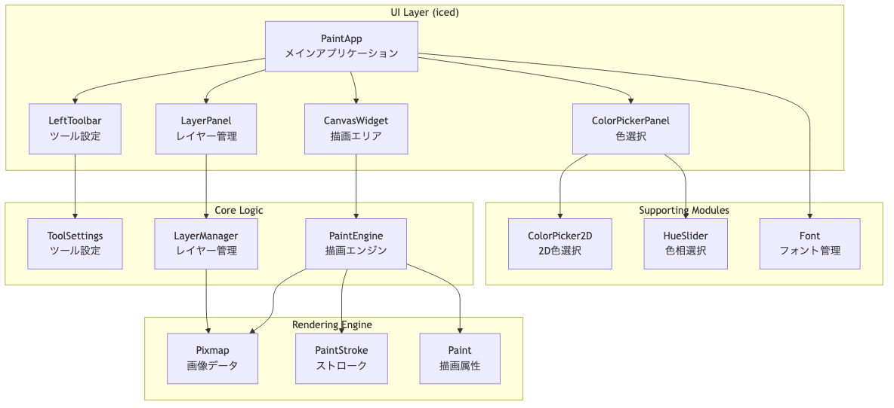
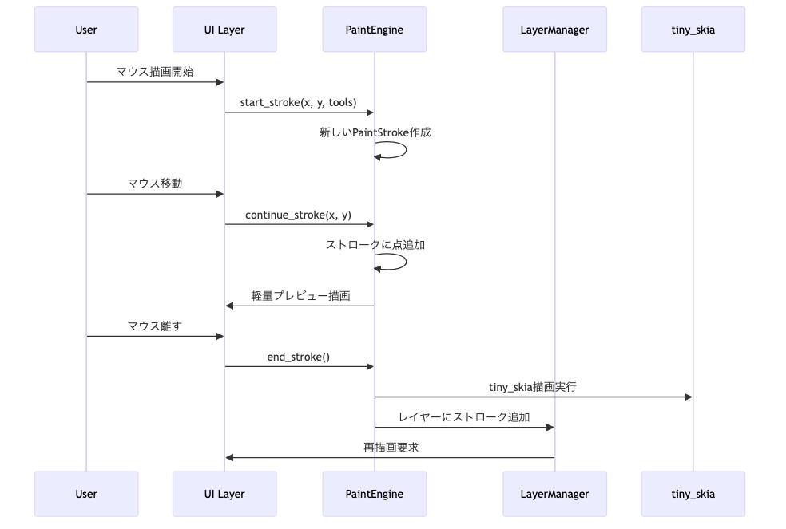
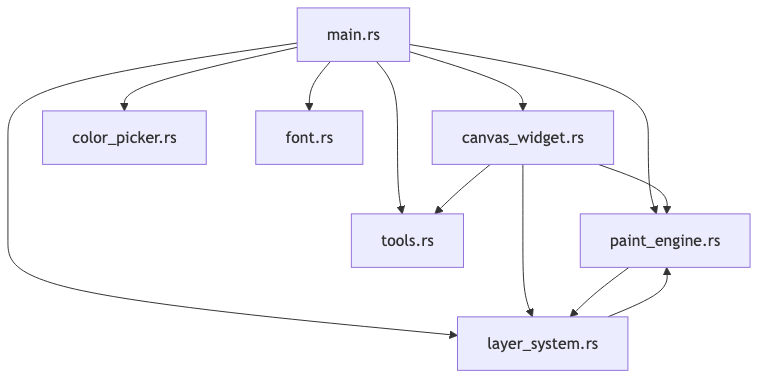

# Rust Painter 技術仕様書

## 目次

1. [概要](#概要)
2. [アーキテクチャ全体像](#アーキテクチャ全体像)
3. [依存関係とクレート](#依存関係とクレート)
4. [モジュール構成](#モジュール構成)
5. [データ構造と型定義](#データ構造と型定義)
6. [主要構造体の詳細解説](#主要構造体の詳細解説)
7. [関数レベル実装詳細](#関数レベル実装詳細)
8. [外部クレートAPI詳細](#外部クレートapi詳細)
9. [パフォーマンス最適化](#パフォーマンス最適化)
10. [今後の拡張計画](#今後の拡張計画)

---

## 概要

**Rust Painter**は、Rust言語で開発された高品質2Dペイントアプリケーションです。現代的なGUIフレームワーク`iced 0.12`と高性能描画エンジン`tiny-skia 0.11`を組み合わせることで、プロフェッショナルレベルの描画機能を実現しています。

### 主要機能
- **リアルタイム描画**: 円形ブラシによる滑らかな描画
- **多層レイヤーシステム**: 無制限レイヤー、透明度制御、順序変更
- **高度なカラーピッカー**: HSV色空間による2D色選択
- **背景レイヤー保護**: 白背景の固定レイヤー
- **直感的UI**: 3カラムレイアウトによる最適化されたワークフロー

### 技術的特徴
- **Memory Safe**: Rust言語の所有権システムによる安全なメモリ管理
- **High Performance**: tiny-skiaによるGPU加速レンダリング
- **Cross Platform**: icedフレームワークによるクロスプラットフォーム対応
- **Modular Design**: 明確な責任分離による保守性の高い設計

---

## アーキテクチャ全体像



### データフロー



---

## 依存関係とクレート

### 主要依存関係

```toml
[dependencies]
iced = { version = "0.12", features = ["canvas", "tokio"] }
`tiny-skia` = "0.11"
uuid = { version = "1.0", features = ["v4"] }
```

### クレート詳細

#### iced 0.12
- **目的**: クロスプラットフォームGUIフレームワーク
- **使用機能**:
  - `canvas`: カスタム描画ウィジェット
  - `tokio`: 非同期ランタイム
- **アーキテクチャ**: Elm-inspired アーキテクチャ（Model-View-Update）

#### `tiny-skia` 0.11
- **目的**: 高性能2Dグラフィックスライブラリ
- **特徴**:
  - CPU-based レンダリング
  - Skia APIとの互換性
  - memory-safe実装

#### uuid 1.0
- **目的**: レイヤーの一意識別子生成
- **使用機能**: v4 UUIDランダム生成

---

## モジュール構成

```
src/
├── main.rs              # メインアプリケーションとUI構築
├── canvas_widget.rs     # カスタムキャンバスウィジェット
├── paint_engine.rs      # 描画エンジンとストローク管理
├── layer_system.rs      # レイヤー管理システム
├── tools.rs            # ツール設定と状態管理
├── color_picker.rs     # カラーピッカーウィジェット
└── font.rs             # フォント設定
```

### モジュール依存関係



---

## データ構造と型定義

### 主要なメッセージ型

```rust
#[derive(Debug, Clone)]
pub enum Message {
    // ツール関連
    ToolChanged(Tool),
    BrushSizeChanged(f32),
    BrushOpacityChanged(f32),
    ColorChanged(Color),
    
    // HSV カラーピッカー関連
    HueChanged(f32),
    SaturationChanged(f32),
    ValueChanged(f32),
    ColorPickerChanged(f32, f32, f32),
    
    // レイヤー関連
    LayerAction(LayerAction),
    
    // キャンバス関連
    CanvasMessage(canvas::Event),
    
    // 描画関連
    StartStroke(iced::Point),
    ContinueStroke(iced::Point),
    EndStroke,
}
```

この`Message`enum は、Elmアーキテクチャの核となる型で、アプリケーション内で発生するすべてのイベントを表現します。

### ツール定義

```rust
#[derive(Debug, Clone, Copy, PartialEq)]
pub enum Tool {
    Pen,
    Eraser,
}
```

### レイヤーアクション

```rust
#[derive(Debug, Clone)]
pub enum LayerAction {
    Add,
    Delete,
    MoveUp(usize),
    MoveDown(usize),
    SetOpacity(usize, f32),
    SetVisible(usize, bool),
    Rename(usize, String),
    SetActive(usize),
}
```

---

## 主要構造体の詳細解説

### PaintApp - メインアプリケーション構造体

```rust
pub struct PaintApp {
    tools: ToolSettings,
    layer_manager: LayerManager,
    paint_engine: PaintEngine,
    should_redraw: bool,
}
```

#### フィールド解説

- **`tools: ToolSettings`**: 現在選択されているツールの設定（ブラシサイズ、色、透明度など）
- **`layer_manager: LayerManager`**: すべてのレイヤーの管理と操作
- **`paint_engine: PaintEngine`**: 描画処理の中核エンジン
- **`should_redraw: bool`**: 再描画が必要かどうかのフラグ

#### Application トレイト実装

`PaintApp`は`iced::Application`トレイトを実装し、以下のメソッドを提供：

- **`new(_flags: ()) -> (Self, Command<Message>)`**: アプリケーション初期化
- **`title(&self) -> String`**: ウィンドウタイトル
- **`update(&mut self, message: Message) -> Command<Message>`**: メッセージ処理とステート更新
- **`view(&self) -> Element<Message>`**: UI構築

### Layer - レイヤー構造体

```rust
#[derive(Debug, Clone)]
pub struct Layer {
    pub id: Uuid,
    pub name: String,
    pub pixmap: Pixmap,
    pub strokes: Vec<PaintStroke>,
    pub visible: bool,
    pub opacity: f32,
}
```

#### フィールド解説

- **`id: Uuid`**: レイヤーの一意識別子（UUID v4）
- **`name: String`**: レイヤーの表示名
- **`pixmap: Pixmap`**: tiny_skiaのPixmap（実際の画像データ）
- **`strokes: Vec<PaintStroke>`**: 確定済みストロークのリスト（iced表示用）
- **`visible: bool`**: レイヤーの表示/非表示状態
- **`opacity: f32`**: レイヤーの透明度（0.0-1.0）

#### 二重データ管理システム

Layerは**デュアルレンダリングシステム**を採用：

1. **`pixmap`**: tiny_skiaによる高品質レンダリング（最終出力用）
2. **`strokes`**: icedによる軽量プレビュー（リアルタイム表示用）

この設計により、パフォーマンスと品質の両立を実現しています。

### LayerManager - レイヤー管理システム

```rust
#[derive(Debug)]
pub struct LayerManager {
    layers: Vec<Layer>,
    active_layer_index: usize,
    canvas_width: u32,
    canvas_height: u32,
}
```

#### 主要メソッド

- **`add_background_layer()`**: 白背景の固定レイヤー作成
- **`add_layer(name: String)`**: 新規レイヤー追加
- **`remove_layer(index: usize)`**: レイヤー削除（背景レイヤー保護）
- **`move_layer_up/down(index: usize)`**: レイヤー順序変更
- **`get_visible_strokes()`**: 表示可能なストロークリスト取得

### PaintEngine - 描画エンジン

```rust
#[derive(Debug)]
pub struct PaintEngine {
    current_stroke: Option<PaintStroke>,
    pub width: u32,
    pub height: u32,
}
```

#### 描画フロー

1. **`start_stroke(x, y, tools)`**: 新しいストローク開始
2. **`continue_stroke(x, y)`**: ストロークに点追加
3. **`end_stroke(layer_manager)`**: ストローク確定とレイヤー保存

### PaintStroke - ストローク定義

```rust
#[derive(Debug, Clone)]
pub struct PaintStroke {
    pub points: Vec<StrokePoint>,
    pub stroke_width: f32,
    pub color: Color,
    pub tool: Tool,
}

#[derive(Debug, Clone, Copy)]
pub struct StrokePoint {
    pub x: f32,
    pub y: f32,
}
```

#### ストローク補間システム

点と点の間を補間して滑らかな描画を実現：

```rust
// 補間アルゴリズム
let step_size = stroke_width / 4.0;
let steps = (distance / step_size).ceil() as i32;

for i in 1..steps {
    let t = i as f32 / steps as f32;
    let x = p1.x + dx * t;
    let y = p1.y + dy * t;
    // 補間点に円を描画
}
```

### CanvasWidget - キャンバスウィジェット

```rust
#[derive(Debug)]
pub struct PaintCanvas<'a> {
    paint_engine: &'a PaintEngine,
    layer_manager: &'a LayerManager,
    tools: &'a ToolSettings,
    cache: canvas::Cache,
    confirmed_strokes_cache: canvas::Cache,
}
```

#### canvas::Program トレイト実装

- **`update()`**: マウスイベント処理と描画状態更新
- **`draw()`**: フレーム描画とキャッシュ管理
- **`mouse_interaction()`**: マウスカーソル形状制御

---

## 関数レベル実装詳細

### メインアプリケーション更新ロジック

```rust
fn update(&mut self, message: Message) -> iced::Command<Message> {
    match message {
        Message::StartStroke(point) => {
            self.paint_engine.start_stroke(point.x, point.y, &self.tools);
            self.should_redraw = true;
        }
        Message::ContinueStroke(point) => {
            self.paint_engine.continue_stroke(point.x, point.y);
            self.should_redraw = true;
        }
        Message::EndStroke => {
            self.paint_engine.end_stroke(&mut self.layer_manager);
            self.should_redraw = true;
        }
        // ... 他のメッセージ処理
    }
    iced::Command::none()
}
```

### レイヤー描画システム

```rust
pub fn get_visible_strokes(&self) -> Vec<(&PaintStroke, f32)> {
    let mut strokes = Vec::new();
    
    // レイヤーを下から上へ（描画順）
    for layer in &self.layers {
        if layer.visible {
            for stroke in &layer.strokes {
                strokes.push((stroke, layer.opacity));
            }
        }
    }
    
    strokes
}
```

### 円形ブラシ描画実装

```rust
fn draw_stroke_to_frame(&self, frame: &mut Frame, stroke: &PaintStroke, layer_opacity: f32) {
    // レイヤー透明度を適用した色を計算
    let final_color = Color::from_rgba(
        stroke_color.r,
        stroke_color.g,
        stroke_color.b,
        stroke_color.a * layer_opacity,
    );
    
    // 各点に円を描画
    for point in &stroke.points {
        frame.fill(
            &Path::circle(Point::new(point.x, point.y), stroke.stroke_width / 2.0),
            final_color,
        );
    }
    
    // 点間補間による滑らか描画
    if stroke.points.len() > 1 {
        for window in stroke.points.windows(2) {
            // 補間処理...
        }
    }
}
```

### UI構築システム

#### 3カラムレイアウト実装

```rust
fn view(&self) -> Element<Message> {
    let left_toolbar = self.create_left_toolbar();
    let layer_panel = self.create_layer_panel();
    let canvas = self.create_canvas();
    let color_picker_panel = self.create_color_picker_panel();

    let main_content = row![
        container(layer_panel).width(250),      // 左: レイヤー
        container(canvas).width(Length::Fill),  // 中央: キャンバス
        container(color_picker_panel).width(280), // 右: カラー
    ];

    column![
        container(left_toolbar).height(120),
        container(main_content).height(Length::Fill),
    ]
    .into()
}
```

#### レイヤーパネルUI構築

```rust
fn create_layer_panel(&self) -> Element<Message> {
    let mut layer_list = column![].spacing(5);
    
    // レイヤーを逆順で表示（上が最前面）
    for (index, layer) in layers.iter().enumerate().rev() {
        let is_active = index == active_index;
        let is_background = index == 0;
        
        // レイヤー選択ボタン
        let layer_button = if is_active {
            button(text(&layer.name))
                .style(iced::theme::Button::Primary)
        } else {
            button(text(&layer.name))
                .style(iced::theme::Button::Secondary)
        };
        
        // 表示/非表示チェックボックス
        let visibility_checkbox = checkbox("", layer.visible)
            .on_toggle(move |visible| {
                Message::LayerAction(LayerAction::SetVisible(index, visible))
            });
        
        // 透明度スライダー（背景レイヤー以外）
        let opacity_control: Element<Message> = if !is_background {
            row![
                text("透明度:").size(12),
                slider(0.0..=1.0, layer.opacity, move |opacity| {
                    Message::LayerAction(LayerAction::SetOpacity(index, opacity))
                }),
                text(format!("{:.0}%", layer.opacity * 100.0))
            ].into()
        } else {
            Space::with_height(0).into()
        };
        
        // レイヤー項目構築...
    }
}
```

---

## 外部クレートAPI詳細

### iced フレームワーク

#### Application トレイト
```rust
pub trait Application: Sized {
    type Message: Debug + Send;
    type Theme: Default + Clone;
    type Executor: Executor;
    type Flags;

    fn new(flags: Self::Flags) -> (Self, Command<Self::Message>);
    fn title(&self) -> String;
    fn update(&mut self, message: Self::Message) -> Command<Self::Message>;
    fn view(&self) -> Element<'_, Self::Message, Self::Theme, Renderer>;
}
```

#### Widget システム
- **`container()`**: レイアウトとスタイリング
- **`row![]` / `column![]`**: 水平/垂直配置マクロ
- **`button()`**: クリック可能ボタン
- **`slider()`**: 数値選択スライダー
- **`checkbox()`**: チェックボックス
- **`text()`**: テキスト表示
- **`canvas()`**: カスタム描画エリア

#### Canvas API
```rust
pub trait Program<Message> {
    type State: Default;

    fn update(
        &self,
        state: &mut Self::State,
        event: Event,
        bounds: Rectangle,
        cursor: mouse::Cursor,
    ) -> (event::Status, Option<Message>);

    fn draw(
        &self,
        state: &Self::State,
        renderer: &Renderer,
        theme: &Theme,
        bounds: Rectangle,
        cursor: mouse::Cursor,
    ) -> Vec<Geometry>;
}
```

### tiny_skia レンダリングエンジン

#### Pixmap - 画像バッファ
```rust
impl Pixmap {
    pub fn new(width: u32, height: u32) -> Option<Pixmap>
    pub fn fill(&mut self, color: Color)
    pub fn data(&self) -> &[u8]
    pub fn width(&self) -> u32
    pub fn height(&self) -> u32
}
```

#### Paint - 描画属性
```rust
impl Paint<'_> {
    pub fn set_color(&mut self, color: Color)
    pub fn set_blend_mode(&mut self, blend_mode: BlendMode)
    pub fn set_anti_alias(&mut self, anti_alias: bool)
}
```

#### Path - 描画パス
```rust
impl PathBuilder {
    pub fn move_to(&mut self, x: f32, y: f32)
    pub fn line_to(&mut self, x: f32, y: f32)
    pub fn close(&mut self)
    pub fn finish(self) -> Option<Path>
}
```

#### Stroke - 線描画属性
```rust
impl Stroke {
    pub fn new(width: f32) -> Self
    pub fn with_line_cap(mut self, line_cap: LineCap) -> Self
    pub fn with_line_join(mut self, line_join: LineJoin) -> Self
}
```

### UUID クレート

#### UUID生成
```rust
use uuid::Uuid;

// ランダムUUID生成（v4）
let id = Uuid::new_v4();

// 文字列変換
let id_string = id.to_string();

// 比較とハッシュ
if id1 == id2 { /* ... */ }
```

---

## パフォーマンス最適化

### 描画最適化戦略

#### 1. デュアルレンダリングシステム
- **描画中**: iced軽量プレビュー（リアルタイム性重視）
- **確定後**: tiny_skia高品質レンダリング（品質重視）

#### 2. ストローク補間最適化
```rust
// 適応的補間密度
let step_size = stroke_width / 4.0;
let steps = (distance / step_size).ceil() as i32;

// 距離に応じた補間点密度調整
if distance < stroke_width {
    // 短距離：補間なし
    return;
}
```

#### 3. キャッシュシステム
```rust
let cache = &self.cache;
let canvas = cache.draw(renderer, bounds.size(), |frame: &mut Frame| {
    // 重い描画処理はキャッシュされる
});
```

### メモリ管理最適化

#### 1. 効率的なデータ構造
- **Vec<StrokePoint>**: 連続メモリ配置
- **Option<PaintStroke>**: 描画中のみメモリ使用

#### 2. 不要コピー回避
```rust
// 参照渡しによる効率化
pub fn get_visible_strokes(&self) -> Vec<(&PaintStroke, f32)>
```

---

## 今後の拡張計画

### Phase 3: ファイル操作機能
- PNG/JPEG エクスポート機能
- プロジェクトファイル保存・読み込み
- 画像インポート機能

### Phase 4: 高度描画ツール
- 矩形・円形・直線描画ツール
- バケツツール（塗りつぶし）
- 選択ツール（範囲選択・移動・変形）

### Phase 5: プロフェッショナル機能
- レイヤーブレンドモード
- フィルター・エフェクト
- アニメーション機能
- プラグインシステム

---

## 技術的課題と解決策

### 解決済み課題

1. **eGUIの制限**: tiny_skia移行により解決
2. **描画パフォーマンス**: デュアルレンダリングで解決
3. **レイヤー透明度処理**: 適切なブレンドモードで解決

### 継続監視項目

1. **大量ストローク処理**: 空間分割による最適化検討
2. **メモリ使用量**: 長時間使用時のメモリリーク監視
3. **レンダリング最適化**: GPU活用の可能性検討

---

## 開発ガイドライン

### コード品質基準
- **型安全性**: Rustの型システム活用
- **エラーハンドリング**: `Option`と`Result`の適切な使用
- **文書化**: すべてのpublic APIにdocコメント
- **テスト**: 単体テストとintegrationテスト

### パフォーマンス基準
- **応答性**: UI操作は16ms以内に応答
- **メモリ効率**: 不要なアロケーション回避
- **スケーラビリティ**: 大量データ処理への対応

---

*最終更新日: 2025-06-26*
*バージョン: 2.0.0*
*作成者: Claude (Rust Painter Development Team)*